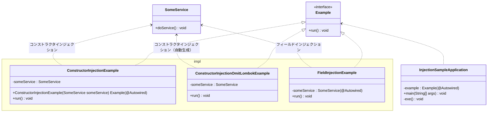

# README

フィールドインジェクション，コンストラクタインジェクションを試す例。

## クラス図
◯◯ InjectionExampleのいずれかのクラスに@Componentを付与して，Bean（Springが管理するインスタンス）とする（@Componentがないクラスは無関係）。

DIしている箇所は２つある：
- SomeService（使われるクラス）が◯◯ InjectionExampleの@Autowiredが付与されている部分（コンストラクタ，フィールド）に依存性を注入
  - @Componentで生成したSomeServiceインスタンスを，◯◯ InjectionExampleクラスの@Autowiredを付与した部分（フィールド，コンストラクタ）で受け取る。
  - SomeService（クラス）が◯◯InjectionExampleにDIしている。
- ExampleインターフェースがInjectionSampleApplicationクラスに依存性を注入
  - @Componentで生成した◯◯InjectionExampleクラスインスタンスを，Exampleインターフェースを介して，InjectionExampleApplicationクラスでExample型の変数を宣言し@Autowiredを付与することで，インスタンスを受け取っている。
  - Example（インターフェース）がInjectionSampleApplicationにDIしている。

